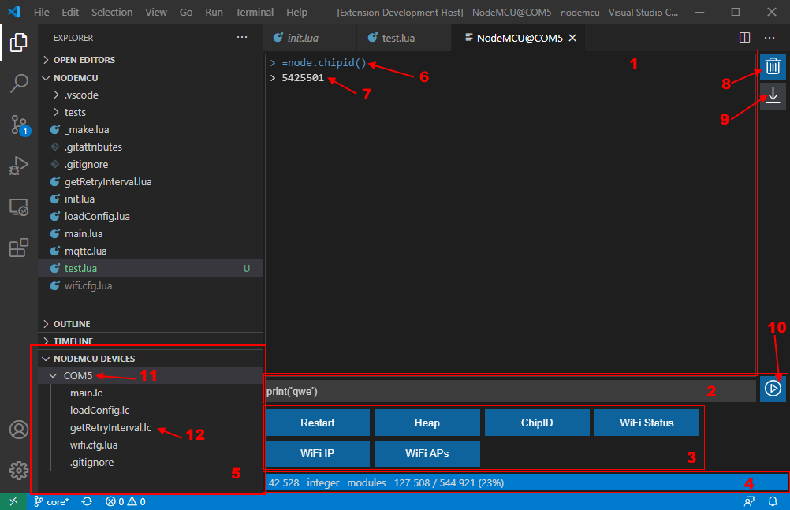

Extension brings NodeMCU device interaction to Visual Studio Code.

## Features

_(see detailed description below)_

* Browse devices in a special TreeView
* Use terminal for each connected device to execute commands
* Upload file to device from VSCode explorer
* Download file from device to solution folder
* Compile, delete, run LUA file on device
* Work with many devices simultaneously
* Works on all platforms (Windows, Linux, MacOS)

[See our wiki for more info](https://github.com/BoresXP/nodemcu-tools/wiki).

## Window layout

### 1. Terminal

Here you can see output from device. Data sent to device (6) and received from device (7) are listed in different colors.
To clear terminal use button (8) on the right.
If you scroll terminal up it will automatically stop scrolling to bottom. To restore this behavior press button (9) on the right.

### 2. Command input

Use this input to write or paste command. Command will be posted to device after pressing Return button or pressing button (10) on the right.
Use Up/Down keys to navigate command history. History size can be adjusted in [Settings](#extension-settings).

### 3. Snippets

Buttons to run predefined commands on press. You can customize predefined commands in [extension settings](#extension-settings). Extension comes with some predefined snippets. You can see command text in tooltip when hovering button.

### 4. Status bar

Here you will find device info: free heap, free SSPIF, modules, etc. Hover status bar cells to see what they mean. By clicking any cell you can update displayed info.

### 5. Devices and files tree view

Here you will find all connected NodeMCU devices (11). With right click [connect](#device-context-menu) to it. When connected extension window will open and tree will be populated with files on device. With right click on file (12) you can run [commands](#file-on-device-context-menu) on in. When extension window is closed device will be disconnected.

## Keybindings & Commands

_(ALT commands are available by pressing ALT key when opening menu); on Linux you should use SHIFT key instead_ 

### Explorer context menu:

* **Upload File(s) to device** upload selected file (or multiple files) on device. If you have more than one device connected you will be presented with QuickPick UI to select device to upload file to.
* [ALT] **Upload to device...** upload selected file on device (see above) but lets you change name under which file will be saved.
* **Upload Folder to device** upload all files under folder on device. “Folder_name/” will be prepended to the file_names uploaded to the device.
* [ALT] **Upload files under folder to device** upload all files under folder on device without adding path to the file names.
* **Upload to device and set as LFS** upload selected file on device (see above) and reloads LFS with it.
* [ALT] **Upload to device and set as LFS...** upload selected file on device with LFS refresh (see above) but lets you change name under which file will be saved.
* **Upload to device and compile:** upload file to device (see above), compile it and remove source.
* [ALT] **Run on device:** upload selected file to device, execute it with `dofile` command and immediately delete it from device. Usefull for executing long configuration scripts (for example, to reconfigure LFS and SSPIF sizes).

### Device context menu:

* **Connect:** connect to this device. This will also open main window for this device.
* **Disconnect:** disconnect from device. This will also close main window for device. By the way, closing main window will disconnect device too.

### File on device context menu:

* [On .lua files only] **Compile**: compile selected file on device and remove source.
* **Delete:** delete selected file on device. No recovery possible.
* **Download:** download file from device to host machine. File will be saved in the root of workspace.
* [ALT] **Download as...:** download file to host machine (see above) but lets you change name under which file will be saved.
* [On .lua and .lc files only] **Run:** run file on device. It just executes `dofile` command which you will see in terminal (1).

### Active editor window

[On .lua files only] 
* **Send line** Send current line to device
* **Send block** Send selected block to device

## Extension Settings

* **Terminal:**
  * **Scrollback Size:** how many lines of scrollback will terminal (1) have. Min - 10, max - 1000, default - 300.
  * **Command History Size:** how many commands will be held in history. You can navigate command history by pressing up and down arrow keys in command input box (2). Min - 0, max - 100, default - 30.
* **Snippets:** snippets are buttons at the bottom of main window (3). These are just commands to run on device. You can configure it yourself with this setting. Setting itself is an object with each property representing one snippet: name is shown on a button, value is command text. You can set different snippets for each workspace. Workspace snippets _overrides_ ones set in user settings and defaults. With this behavior you can remove some default snippets. 
  * **overwriteSnippets** Controls whether snippets in workspace should overwrite ones in user settings and defaults.
* **minify.enabled**  Controls whether the Lua code should be minified before upload with 'sendLine' and 'sendBlock' commands.
* **deviceFilterActive** Controls whether device filter is active - only known NodeMCU devices (USB vendor-id) will be listed.

## What's New / Change Log

See [Changelog](https://github.com/BoresXP/nodemcu-tools/blob/master/CHANGELOG.md)

## Known issues

Please report issues here: [bugtracker](https://github.com/BoresXP/nodemcu-tools/issues).

## Acknowledgments

- Andi Dittrich for the great console app [NodeMCU-Tool](https://github.com/AndiDittrich/NodeMCU-Tool)
- Furkan Duman for NodeMCU [extension for VSCode](https://github.com/fduman/vscode-nodemcu)
- Icons made by [Gregor Cresnar](https://flaticon.com/authors/gregor-cresnar) from [Flaticon](https://flaticon.com)

## License

This extension is licensed under the [MIT License](https://github.com/BoresXP/nodemcu-tools/blob/master/LICENSE.md).
